# Selected plots and speaking notes

[Study log](STUDY_LOG.md) | [PDF plotbook](../../output/pdf/study_logbook_20260927/HPS_GPR_Recent_Studies_Plot_Logbook.pdf) | [12-minute route](PRESENTATION_NOTES.md)

## P01 - Place the studies in the reach picture

**The new comparisons start from the released samples and explicit exposure assumptions.**

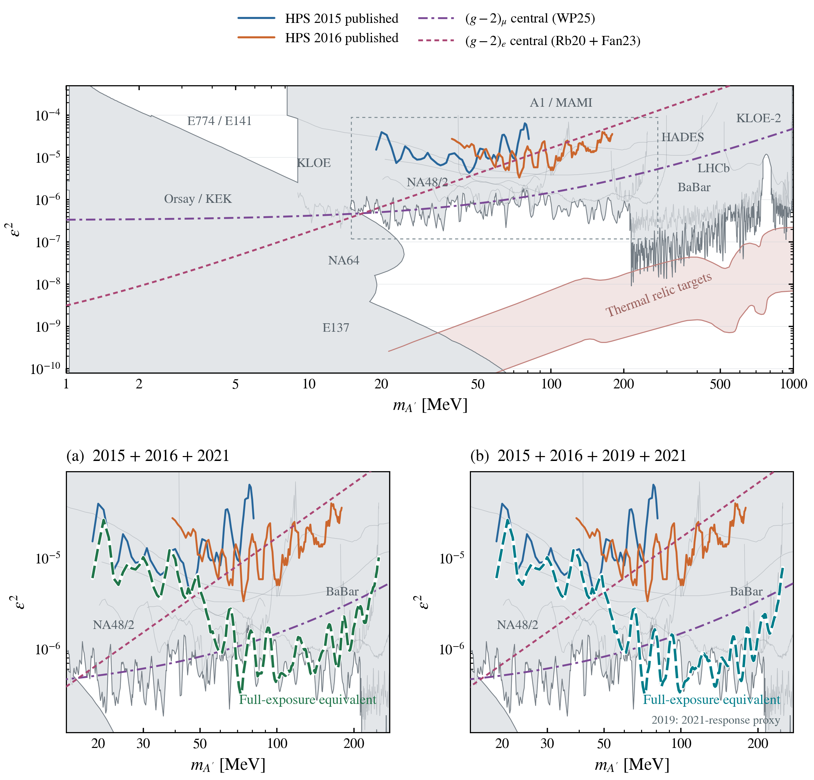

**Read the plot.** Compare the matched lower panels; the added-2019 curve uses a measured 1% high-psum spectrum with borrowed 2021 response/conversion inputs.

**Suggested explanation.** These curves show how the present samples map into an observed-equivalent full-exposure display.

**Claim boundary.** Historical world-contour context and approximate confidence-level conventions are preserved. This is not a calibrated future expected-sensitivity band.

[PNG](assets/P01_figure2_overview_and_projections.png) | [Original vector PDF](assets/P01_figure2_overview_and_projections.pdf) | [Source data / definition](../../study_results/v5p0p4_figure2_publication_20260913/README.md) | [Study package](../../study_results/v5p0p4_figure2_publication_20260913)

## P02 - Explain the beam-energy and geometry dependence

**Magnetic transport and sensor-hit requirements replace the earlier outer-angle surrogate.**

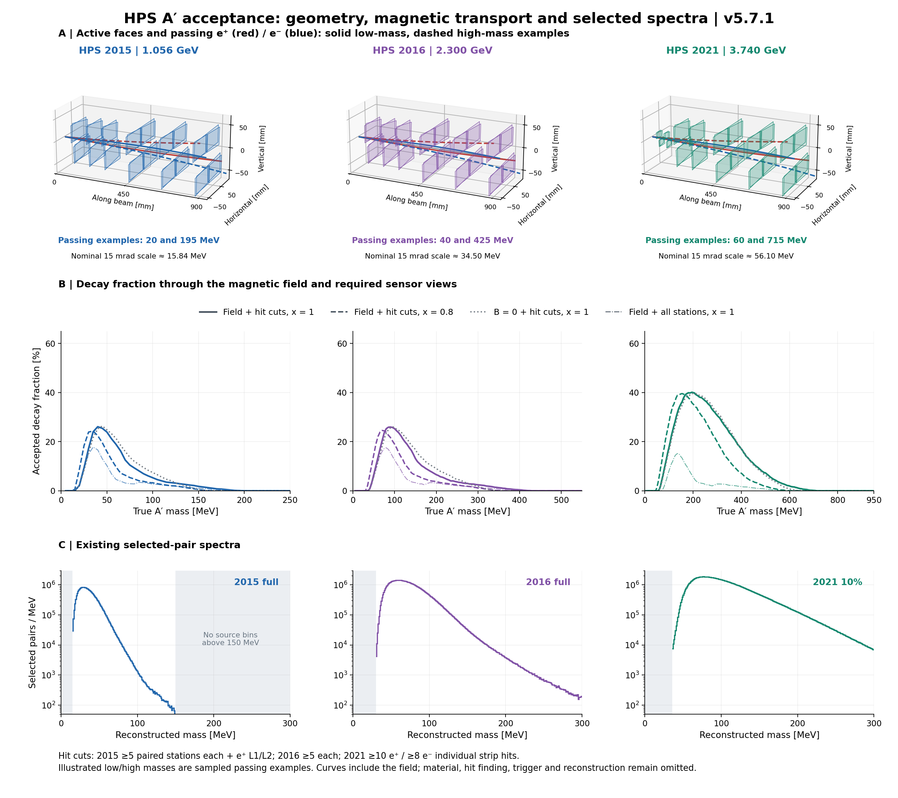

**Read the plot.** Read columns by campaign. Geometry, calculated acceptance and selected mass spectra answer different questions; their vertical scales are not interchangeable.

**Suggested explanation.** The detector geometry and boost help explain the accessible mass scales, while real efficiency requires more information.

**Claim boundary.** Conditional fixed-decay and hit fractions omit production weighting, reconstruction, trigger/selection efficiency and detector uncertainty.

[PNG](assets/P02_HPS_v5p7p1_acceptance_overview.png) | [Original vector PDF](assets/P02_HPS_v5p7p1_acceptance_overview.pdf) | [Source data / definition](../../study_results/v5p7p1_geometry_acceptance_20260913/README.md) | [Study package](../../study_results/v5p7p1_geometry_acceptance_20260913)

## P03 - Keep the raw local excesses identifiable

**The conventional local display uses the unshifted signed likelihood root.**

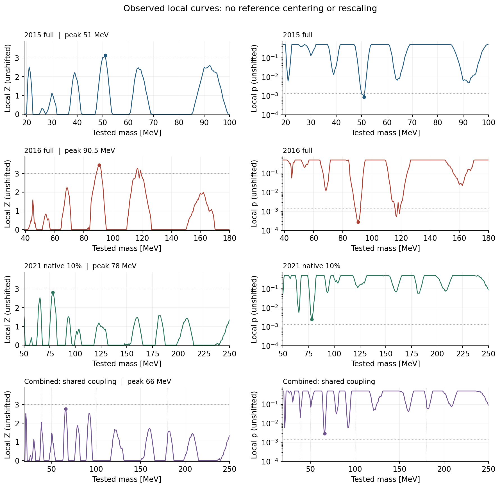

**Read the plot.** Z=max(r,0) and p=Phi(-Z); deficits display p=0.5. The 2016 peak is 90.5 MeV at Z=3.4525; shared coupling peaks at 66 MeV at Z=2.7602.

**Suggested explanation.** These are local, asymptotic summaries of the observed fits. Their ranking is preserved before any reference remapping.

**Claim boundary.** This is the September Gaussian baseline. Do not attach a global probability from a later MC window or different ordering.

[PNG](assets/P03_raw_local_overview.png) | [Original vector PDF](assets/P03_raw_local_overview.pdf) | [Source data / definition](../../study_results/v5p8p5p3_raw_significance_20260921/README.md) | [Study package](../../study_results/v5p8p5p3_raw_significance_20260921)

## P04 - Show what the scan-wide correction changes

**A local peak and the maximum over a mass scan have different null distributions.**

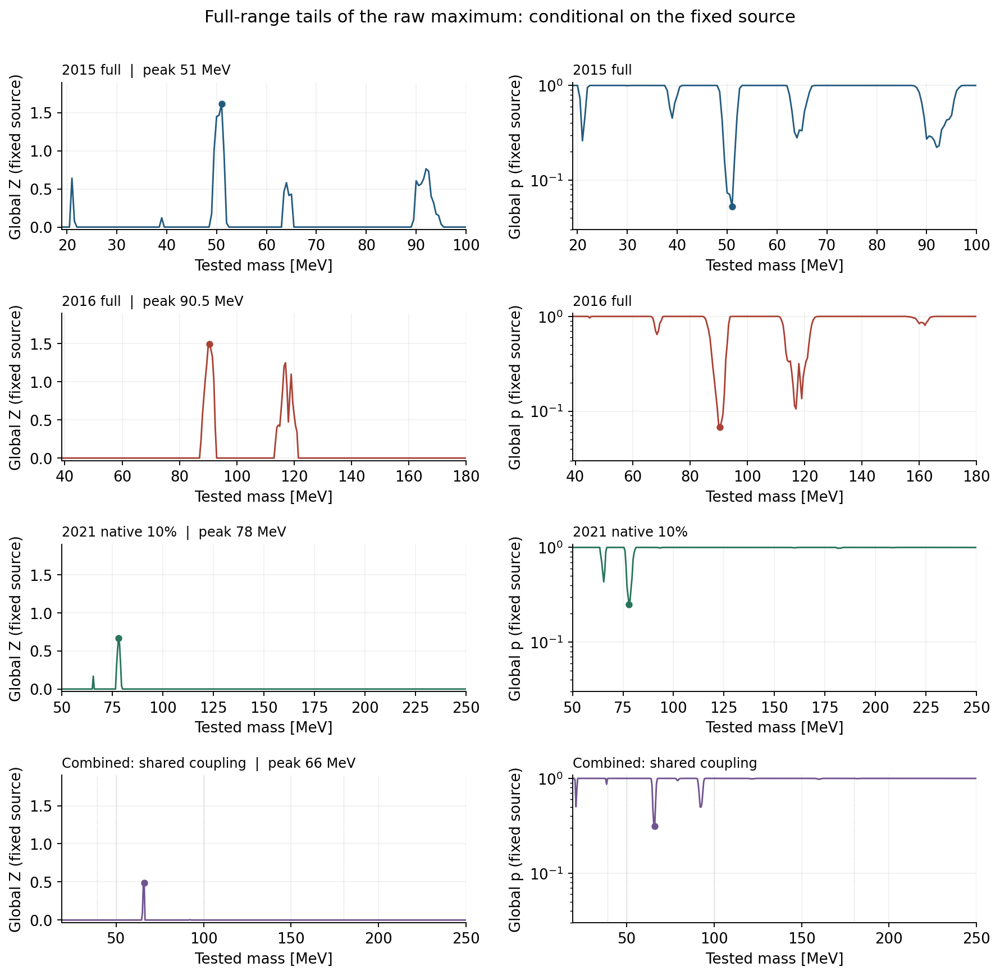

**Read the plot.** The global reference uses the raw maximum and correlated whole-spectrum fluctuations. Follow each stated search domain and source definition.

**Suggested explanation.** The probability must ask how often the whole specified search produces an excursion this large.

**Claim boundary.** The global reference is conditional on fixed observed-derived background sources; prior method and source selection are not included.

[PNG](assets/P04_raw_global_overview.png) | [Original vector PDF](assets/P04_raw_global_overview.pdf) | [Source data / definition](../../study_results/v5p8p5p3_raw_significance_20260921/README.md) | [Study package](../../study_results/v5p8p5p3_raw_significance_20260921)

## P05 - Separate a fixed-mass offset from a positive maximum

**At 78 MeV the null signed-root mean is 0.548, a different effect from maximizing over mass.**

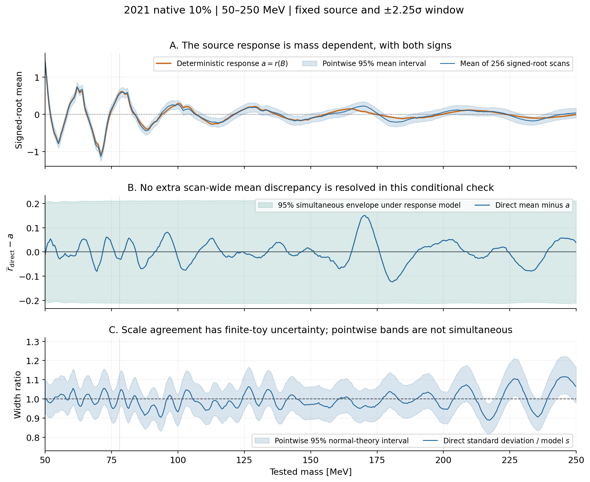

**Read the plot.** Track the mass-dependent signed-root moments. A maximum tends to be positive even when individual signed estimators are centered; a nonzero fixed-mass mean needs its own explanation.

**Suggested explanation.** The selected peak cannot diagnose bias by itself. Here the fixed-source response also shows a local offset.

**Claim boundary.** Moments and tails condition on the frozen generating spectrum; agreement with that source is not proof of physical background adequacy.

[PNG](assets/P05_2021_local_response_moments.png) | [Original vector PDF](assets/P05_2021_local_response_moments.pdf) | [Source data / definition](../../study_results/v5p9p5_null_bias_20260922/README.md) | [Study package](../../study_results/v5p9p5_null_bias_20260922)

## P06 - Use the sideband check with its fitted-toy reference

**All 42 observed values lie inside their pointwise central 90% conditional bands.**

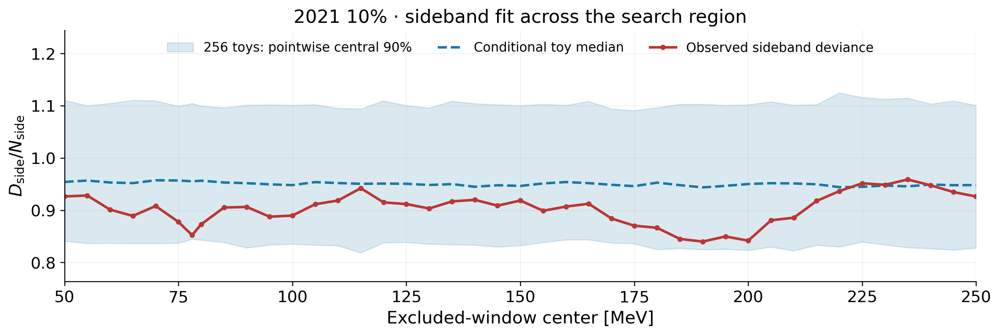

**Read the plot.** Red is observed D_side/N_side; dashed blue is the median from 256 repeated spectra and shading is the 5th-95th percentiles at each center. N_side counts scored bins, not fit degrees of freedom.

**Suggested explanation.** The reference median is about 0.95, so one is not an exact target after fitting.

**Claim boundary.** This scores fitted sidebands. Centers are correlated; pointwise agreement neither gives a global goodness-of-fit probability nor validates the excluded window.

[PNG](assets/P06_slide14_sideband_scan.png) | [Original vector PDF](assets/P06_slide14_sideband_scan.pdf) | [Source data / definition](../../output/slides/unblind_meeting_RCmeet_20260923b/science/data/sideband_center_summary.csv) | [Study package](../../output/slides/unblind_meeting_RCmeet_20260923b)

## P07 - Explain the standardized residual panels

**The residual is a local data-minus-GP difference scaled by counting and GP uncertainty.**

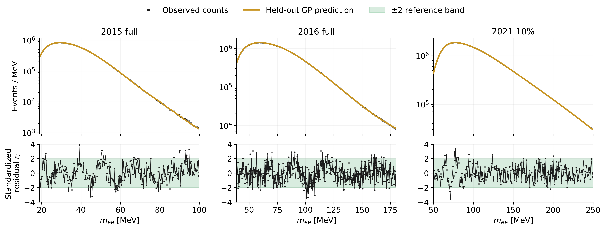

**Read the plot.** Each bin uses a prediction excluding its local signal window. Zero denotes agreement; positive values denote more data. The green +/-2 region is a visual reference.

**Suggested explanation.** These panels make local behavior readable while retaining the fact that neighboring predictions overlap.

**Claim boundary.** The curves join local predictions, not one global fit. The green band is not calibrated simultaneous coverage.

[PNG](assets/P07_slide13_explained.png) | [Original vector PDF](assets/P07_slide13_explained.pdf) | [Source data / definition](../../output/slides/unblind_meeting_RCmeet_20260923b/READING_SLIDES_13_14.md) | [Study package](../../output/slides/unblind_meeting_RCmeet_20260923b)

## P08 - Keep a controlled tail test distinct from native MC

**The controlled primary comparison changes tails while preserving the central unnormalized Gaussian shape.**

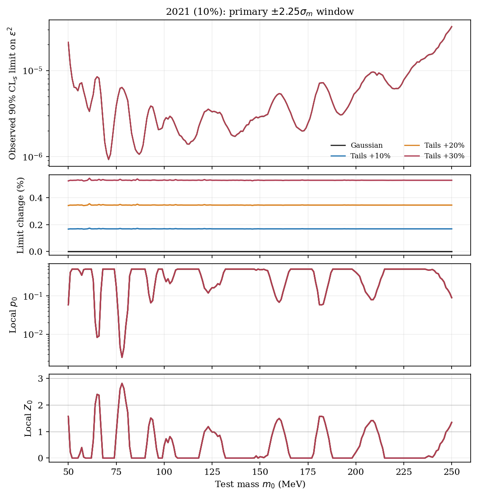

**Read the plot.** Each alternative is compared to a freshly fitted Gaussian with the same +/-2.25 reference-resolution fit and exclusion mask. Full-support normalization is retained.

**Suggested explanation.** This isolates modest tail-family effects under a matched procedure.

**Claim boundary.** It does not cover the broad displaced native MC shapes. Larger guards also change the fit bins and background prediction.

[PNG](assets/P08_primary_2021.png) | [Original vector PDF](assets/P08_primary_2021.pdf) | [Source data / definition](../../study_results/v5p9_tail_structure_20260921/README.md) | [Study package](../../study_results/v5p9_tail_structure_20260921)

## P09 - Show what the native MC curves actually are

**The colored curves are selected MC distributions, with fitted cores used to define coordinates.**

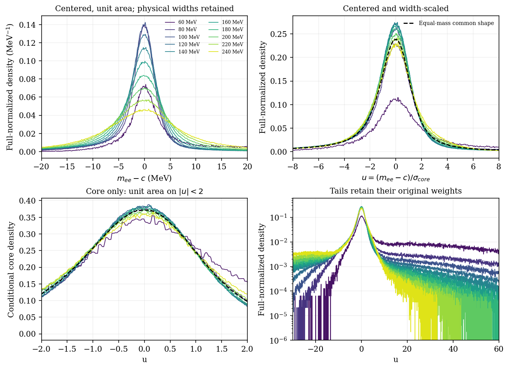

**Read the plot.** Compare full distributions and the aligned core. A Gaussian center/width summary is not the empirical histogram; a common aligned shape is another model.

**Suggested explanation.** The MC contains structure outside a narrow Gaussian core, so normalization and the training region matter.

**Claim boundary.** Selection equivalence and pure resonance association are not established for this supplied catalogue; the common shape remains conditional.

[PNG](assets/P09_shared_shape_overlays.png) | [Original vector PDF](assets/P09_shared_shape_overlays.pdf) | [Source data / definition](../../study_results/v6p1_mc_signal_templates_20260922/README.md) | [Study package](../../study_results/v6p1_mc_signal_templates_20260922)

## P10 - Measure the signal-induced change with paired toys

**Final 40-toy results show better response after shifting the window to the MC core.**

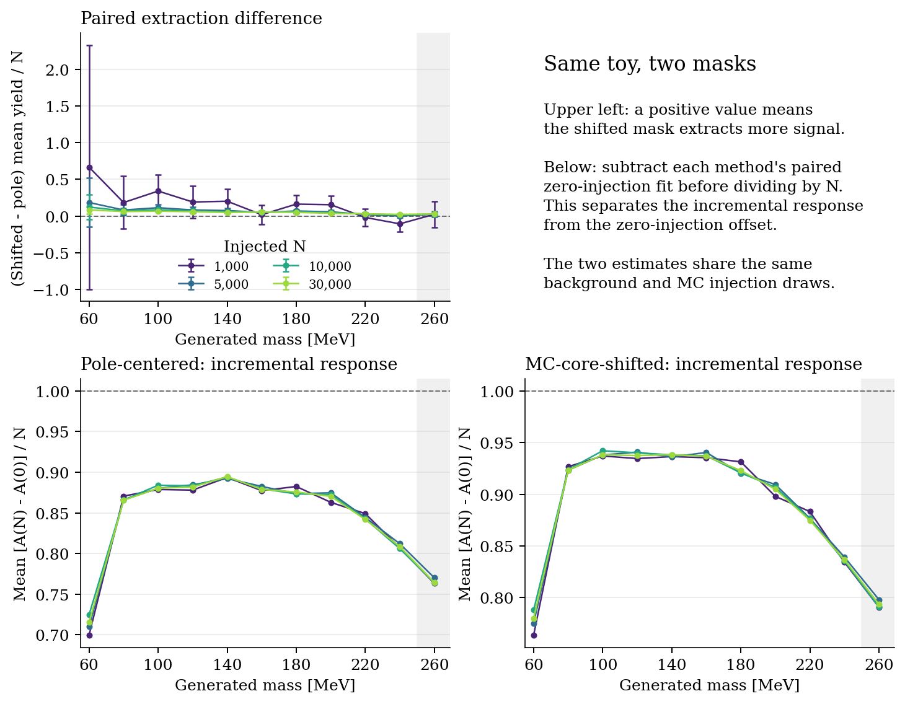

**Read the plot.** At N=30,000, paired response spans 71.5-89.5% for pole windows and 78.0-93.8% for shifted windows. Pairing subtracts the same toy's zero-signal fit; it does not redefine the primary fitted yield.

**Suggested explanation.** Centering helps, but it does not recover every injected selected candidate.

**Claim boundary.** These are exact-N injections with full-category multinomial draws. The 260 MeV extension uses the archived 250 MeV kernel anchor.

[PNG](assets/P10_paired_comparison.png) | [Original vector PDF](assets/P10_paired_comparison.pdf) | [Source data / definition](../../study_results/v6p2_mc_injection_20260923/results/paired.csv) | [Study package](../../study_results/v6p2_mc_injection_20260923)

## P11 - Use controls to locate the response loss

**Signal in GP training bins can be absorbed into the predicted background.**

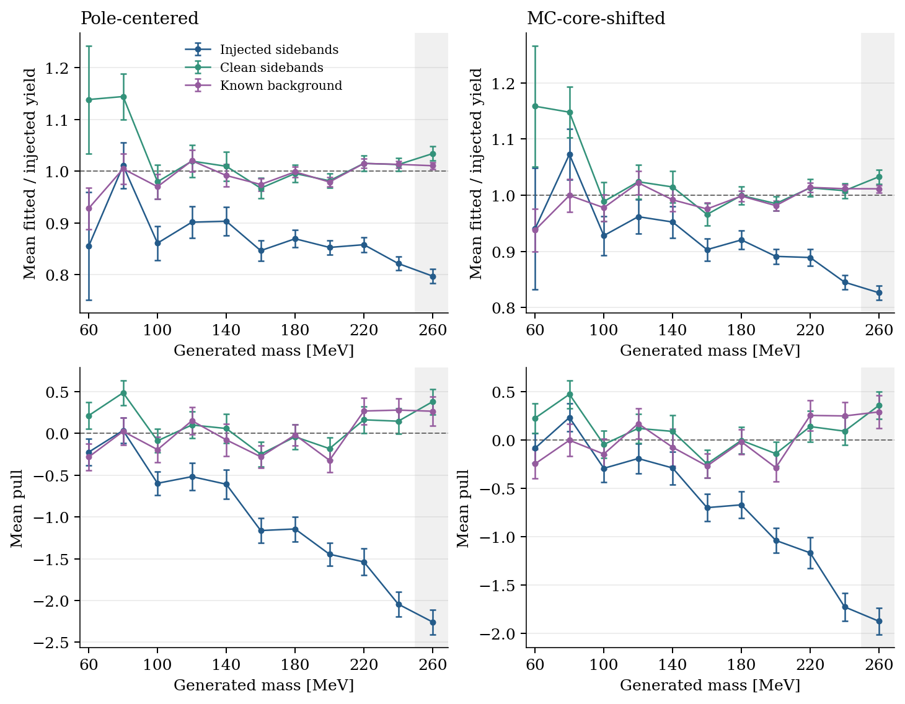

**Read the plot.** Compare the contaminated-sideband result with clean-sideband and known-background controls at the same injected yield. Distinguish raw fitted/injected yield from the increment over the paired null fit.

**Suggested explanation.** A fit can converge and still recover too little signal; the controls identify why.

**Claim boundary.** Clean training and a known background are diagnostic oracles, unavailable for a real unknown signal. Forty-toy containment is not coverage certification.

[PNG](assets/P11_controls_30000.png) | [Original vector PDF](assets/P11_controls_30000.pdf) | [Source data / definition](../../study_results/v6p2_mc_injection_20260923/README.md) | [Study package](../../study_results/v6p2_mc_injection_20260923)

## P12 - Compare shapes at a common expected signal count

**At z=5, paired response is 0.961-0.978 for Gaussian and 0.716-0.894 for native MC.**

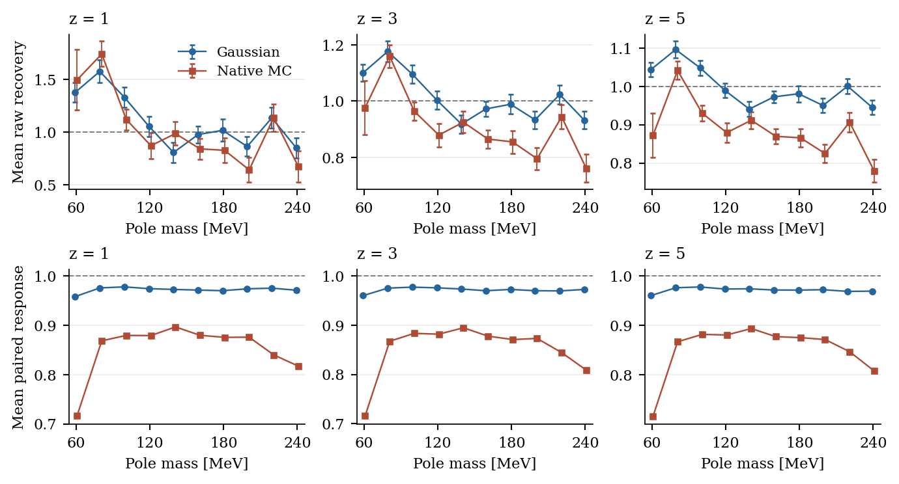

**Read the plot.** An independent 100-background Gaussian pilot fixes s0(m); A=z*s0 is shared by shapes. The 100 evaluation backgrounds are paired, with independently fluctuating Poisson signal totals.

**Suggested explanation.** Equal expected signal counts do not imply equal extraction difficulty.

**Claim boundary.** The pull truth is expected A, not the realized count. Curves summarize correlated cells, not independent measurements to average together.

[PNG](assets/P12_recovery.png) | [Original vector PDF](assets/P12_recovery.pdf) | [Source data / definition](../../study_results/v6p3p1_fixed_yield_2021_100toy_20260924/results/evaluation_summary.csv) | [Study package](../../study_results/v6p3p1_fixed_yield_2021_100toy_20260924)

## P13 - Report containment with its finite denominator

**The z=5 nominal 95% signed sets contain truth in 88-98/100 Gaussian and 88-97/100 MC trials.**

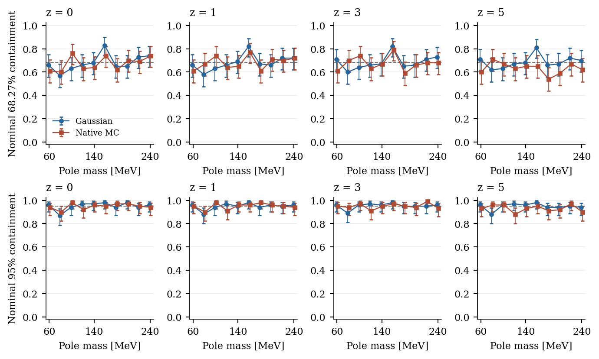

**Read the plot.** These sets use the truth-fixed profile statistic and retain every attempted toy. Exact two-sided 95% Clopper-Pearson intervals quantify count uncertainty.

**Suggested explanation.** Completeness of the run and scientific closure are different: valid fits can still show non-nominal containment.

**Claim boundary.** Signed profile-set containment is not a calibrated physical nonnegative-signal upper limit or unconditional coverage.

[PNG](assets/P13_containment.png) | [Original vector PDF](assets/P13_containment.pdf) | [Source data / definition](../../study_results/v6p3p1_fixed_yield_2021_100toy_20260924/results/evaluation_summary.csv) | [Study package](../../study_results/v6p3p1_fixed_yield_2021_100toy_20260924)

## P14 - Motivate the MC core-center correction

**The reconstructed core shift should be measured from signal MC before observing fit performance.**

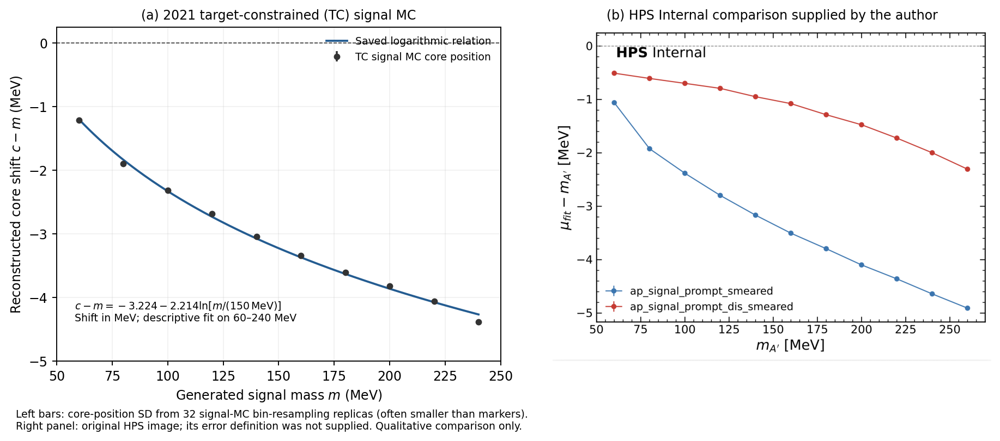

**Read the plot.** The measured core shifts are compared with the stated logarithmic law and the retained user-provided HPS image. MC bars are 32-replica bin-resampling standard deviations.

**Suggested explanation.** A reproducible core center gives a well-defined window shift, but does not fix the tails or signal response.

**Claim boundary.** The retained reference image's error definition was not supplied. The 260 MeV catalogue point is shape-only and outside the logarithmic-law domain.

[PNG](assets/P14_intro_core_shift_comparison.png) | [Original vector PDF](assets/P14_intro_core_shift_comparison.pdf) | [Source data / definition](../../study_results/v6p3p6_readability_2021_20260924/README.md) | [Study package](../../study_results/v6p3p6_readability_2021_20260924)

## P15 - Separate offset correction from response calibration

**A frozen affine correction addresses the null offset and signal response together.**

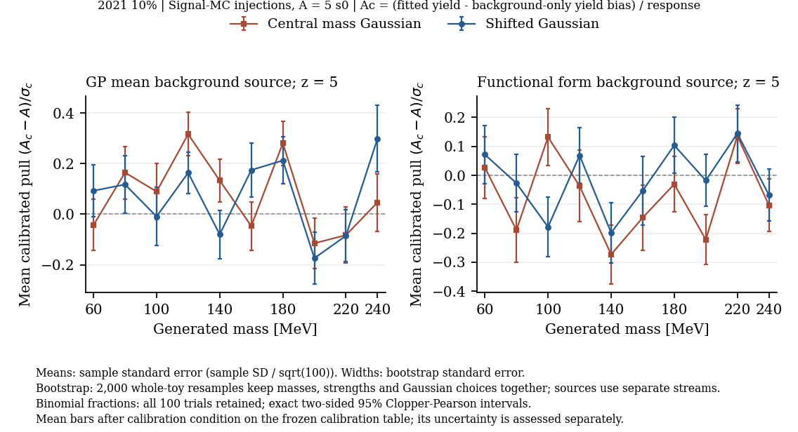

**Read the plot.** A_c=(Ahat-delta)/R. The panels show mean calibrated pulls (A_c-A)/sigma_c at z=5 for two separately calibrated background sources. Bars are standard errors across 100 independent evaluation toys; calibration-table uncertainty is assessed separately.

**Suggested explanation.** Subtracting a null mean cannot restore response. A correction needs both ingredients and an independent evaluation.

**Claim boundary.** These are source-specific diagnostic corrections, not replacements for the primary finite-grid limits or evidence of transfer between background sources.

[PNG](assets/P15_affine.png) | [Original vector PDF](assets/P15_affine.pdf) | [Source data / definition](../../study_results/v6p3p6_readability_2021_20260924/results/heldout_summary.csv) | [Study package](../../study_results/v6p3p6_readability_2021_20260924)

## P16 - Quantify the signal still entering GP training

**The starter window is 11.3-19.8% wider, yet 16.16-27.90% of full selected MC remains in training.**

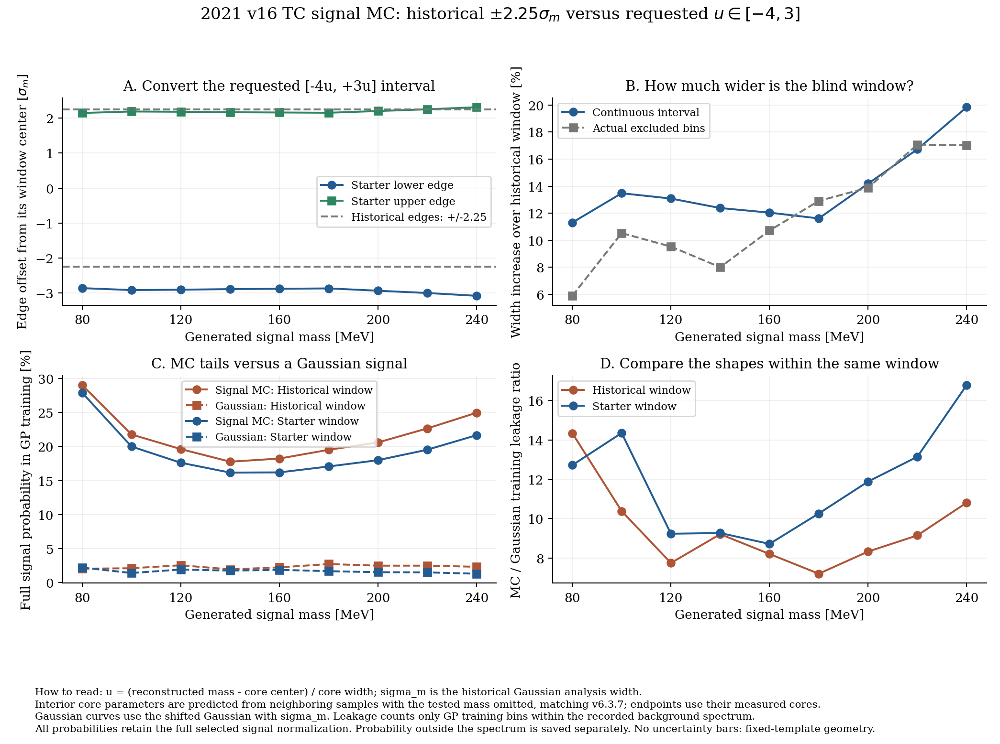

**Read the plot.** Compare the old +/-2.25 reference-sigma mask with [-4,+3] fitted-core-width units over 80-240 MeV. The MC training fraction drops only 1.12-3.30 percentage points.

**Suggested explanation.** A wider exclusion reduces leakage, but a Gaussian estimate substantially understates these MC tails.

**Claim boundary.** Fitted core width and reference resolution are different. Leakage probability is not identical to lost fitted yield.

[PNG](assets/P16_window_width_and_signal_leakage.png) | [Original vector PDF](assets/P16_window_width_and_signal_leakage.pdf) | [Source data / definition](../../study_results/v6p3p7_window_leakage_followup_20260925/window_leakage_by_mass.csv) | [Study package](../../study_results/v6p3p7_window_leakage_followup_20260925)

## P17 - Demonstrate the effect of training contamination

**At 100/160/220 MeV, clean training changes direct-MC response from 0.959/0.950/0.909 to 1.001/0.997/1.000.**

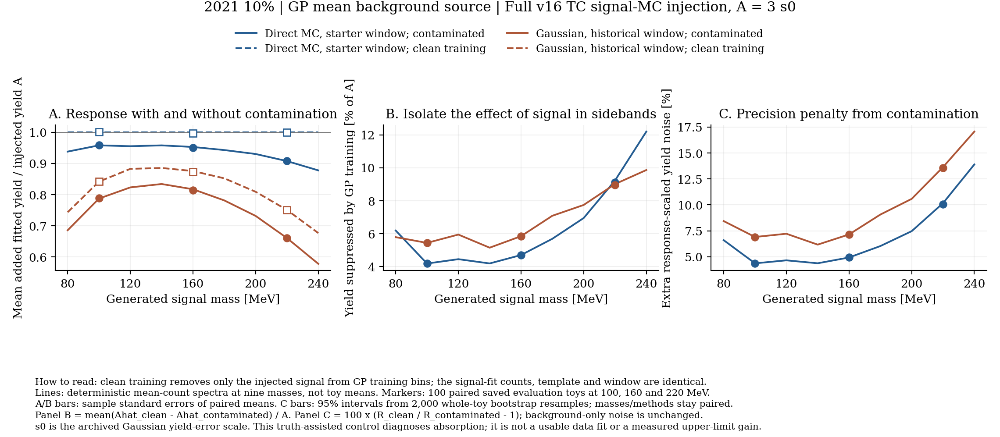

**Read the plot.** Remove injected signal only from the GP training bins; keep fit counts, template and mask fixed. Mean-loss errors are paired standard errors; precision ratios use 2,000 whole-toy bootstrap resamples.

**Suggested explanation.** For an exact MC extraction template, contamination explains almost all the mean response deficit in these tests.

**Claim boundary.** The Gaussian fit can still lose response with clean training because its shape/full-yield convention mismatches MC. This is a controlled diagnostic, not a new limit.

[PNG](assets/P17_leakage_impact_gp_mean.png) | [Original vector PDF](assets/P17_leakage_impact_gp_mean.pdf) | [Source data / definition](../../study_results/v6p3p7_window_leakage_followup_20260925/paired_training_removal_summary.csv) | [Study package](../../study_results/v6p3p7_window_leakage_followup_20260925)

## P18 - Walk through the observed 67 MeV extraction

**The selected MC fit has local asymptotic p=0.00311; 1/1,000 conditional null toys exceed it.**

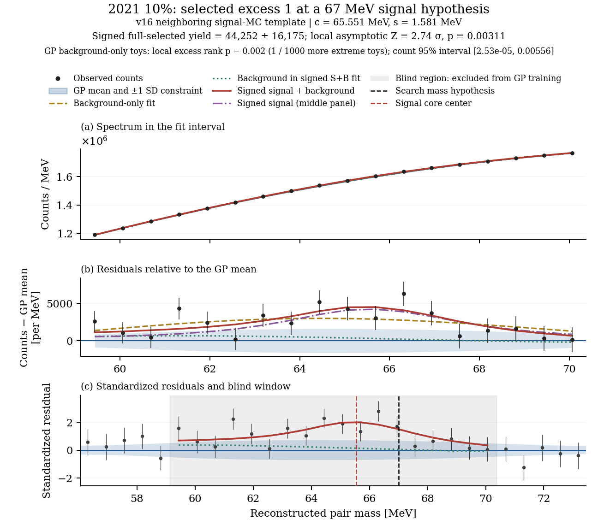

**Read the plot.** Read counts, data-minus-GP residuals and standardized context together. The hypothesis is 67 MeV; the template core is about 65.55 MeV. Full selected probability in training is about 47.34% here.

**Suggested explanation.** This example shows what the signal and profiled background each contribute to the same data.

**Claim boundary.** The selected region is local and post-selection. Rank p=2/1001 has exact 95% interval [0.0000253,0.00556]; it is not a scan-global probability.

[PNG](assets/P18_v638_peak_1.png) | [Original vector PDF](assets/P18_v638_peak_1.pdf) | [Source data / definition](../../study_results/v6p3p8_observed_morph_20260925/results/figure_summary.json) | [Study package](../../study_results/v6p3p8_observed_morph_20260925)

## P19 - Follow the joint scan when only 2021 changes

**The MC-method common-coupling local minimum is 68 MeV: Z=2.910, p=0.001806.**

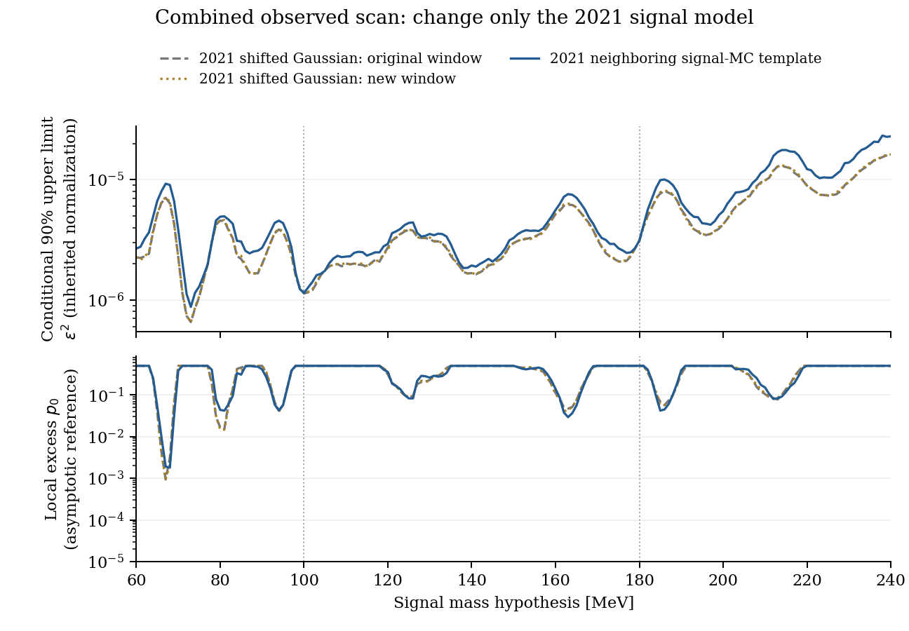

**Read the plot.** Compare 2021 neighboring-MC/[-4,+3]u with the shifted Gaussian in old and new windows. The 2015 and 2016 models remain the earlier ones.

**Suggested explanation.** The joint fit uses one coupling with independent campaign background nuisances.

**Claim boundary.** This is an observed conditional comparison. Its 0/1,000 fixed-mass exceedances imply a finite-sample bound, not zero probability or global evidence.

[PNG](assets/P19_v639_combined_comparison.png) | [Original vector PDF](assets/P19_v639_combined_comparison.pdf) | [Source data / definition](../../study_results/v6p3p9_combined_morph_20260925/results/summary.json) | [Study package](../../study_results/v6p3p9_combined_morph_20260925)

## P20 - Measure the 2016 shift rather than importing 2021

**Qualified 2016 cores shift down by 0.08-1.02 MeV, less than the saved 2021 shifts.**

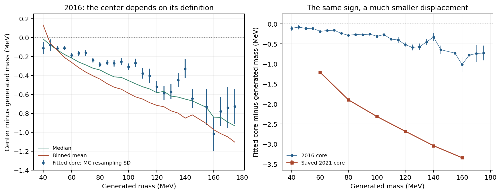

**Read the plot.** Core, median and full mean are different location summaries. The comparison uses the supplied histogram already smeared/scaled with FEE corrections.

**Suggested explanation.** The sign is similar across campaigns, but the 2021 shift law is not a 2016 prescription.

**Claim boundary.** MC bin-resampling errors and fit-definition sensitivity are separate. The 30 and 35 MeV samples remain diagnostic-only.

[PNG](assets/P20_centers_and_2021.png) | [Original vector PDF](assets/P20_centers_and_2021.pdf) | [Source data / definition](../../study_results/v6p4_2016_mc_shapes_20260925/results/centers_and_shapes.csv) | [Study package](../../study_results/v6p4_2016_mc_shapes_20260925)

## P21 - Check the interpolation on omitted masses

**Neighboring-template interpolation gives held-out CDF discrepancies of 0.14-0.76 percentage points.**

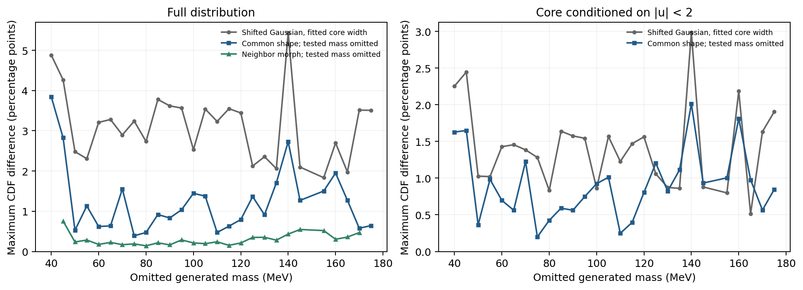

**Read the plot.** Compare the shape discrepancy of an omitted native sample with neighboring-CDF interpolation, a common empirical shape, and Gaussian descriptions. Centers/widths are predicted for the held-out sample.

**Suggested explanation.** The neighboring empirical shapes are a defensible full-shape starting point within the supplied grid.

**Claim boundary.** Descriptive MC discrepancy is not a calibrated inference error or detector-systematics estimate. No 150 MeV sample was supplied.

[PNG](assets/P21_shape_holdout.png) | [Original vector PDF](assets/P21_shape_holdout.pdf) | [Source data / definition](../../study_results/v6p4_2016_mc_shapes_20260925/results/shape_comparisons.csv) | [Study package](../../study_results/v6p4_2016_mc_shapes_20260925)

## P22 - Test whether a smaller limit really improves sensitivity

**Narrowing +/-3.5u to +/-2u lowers response; response-adjusted precision changes little.**

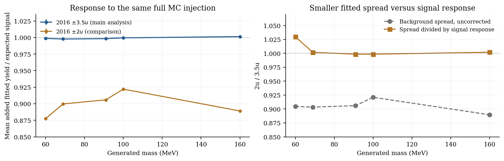

**Read the plot.** Five masses with 200 paired experiments give responses 0.877-0.922 versus 0.998-1.001. The spread/response ratio between windows is 0.998-1.030; response bars are standard errors of paired means.

**Suggested explanation.** The lower raw fit spread is largely canceled by the loss of signal response.

**Claim boundary.** The median observed limit falls 9.64%, but that alone is not a sensitivity gain. This is not the later +/-2.5u global protocol.

[PNG](assets/P22_window_response.png) | [Original vector PDF](assets/P22_window_response.pdf) | [Source data / definition](../../study_results/v6p4p2_2016_window_comparison_20260925/results/window_comparison/signal_response.csv) | [Study package](../../study_results/v6p4p2_2016_window_comparison_20260925)

## P23 - Lead with the independently checked global probability

**Combined: 75/1,024 B scans, add-one p=0.07415 and 95% interval [0.05804,0.09095].**

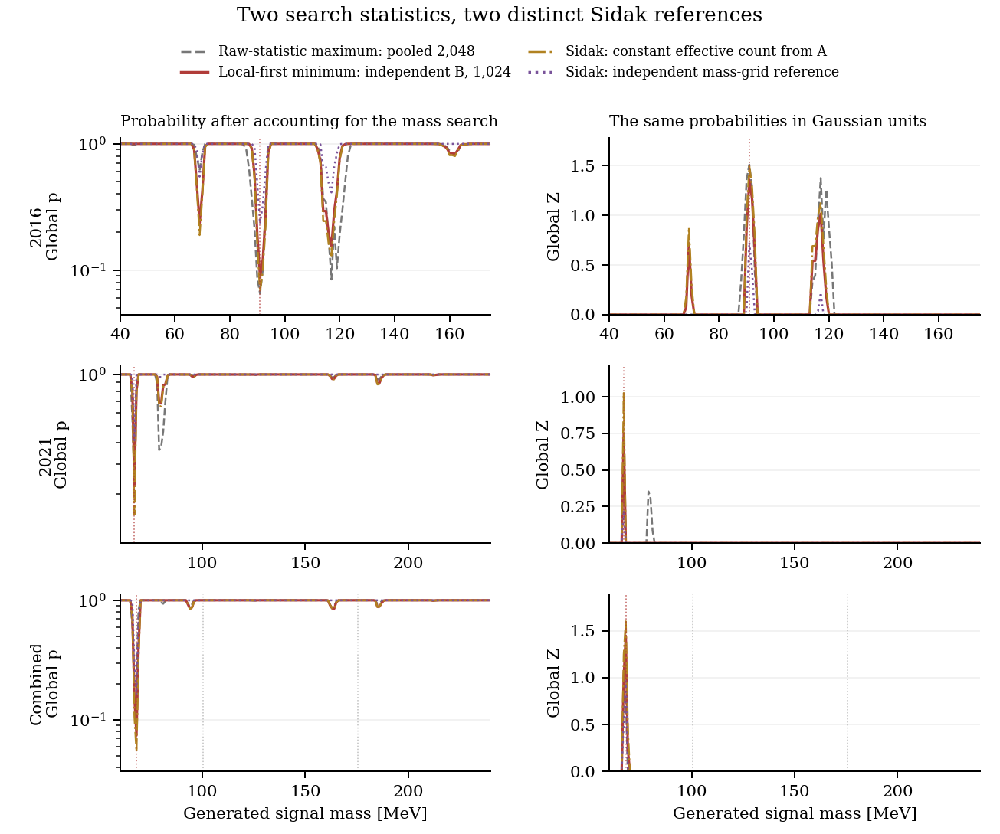

**Read the plot.** A fixes mass-dependent local rank maps; independent B tests the minimum mapped p across the declared grid. 2016: p=0.08780; 2021: p=0.22634. Intervals are exact two-sided 95% Clopper-Pearson count intervals.

**Suggested explanation.** The common-coupling result is a modest conditional scan-wide excess, about 1.45 Gaussian-equivalent sigma.

**Claim boundary.** Combined is one joint coupling, not a choice among three searches. The A-map floor is 1/1025; B ties count. Source/map uncertainty and prior selection are omitted.

[PNG](assets/P23_calibrated_global_mass_comparison.png) | [Original vector PDF](assets/P23_calibrated_global_mass_comparison.pdf) | [Source data / definition](../../study_results/v6p4p4_calibrated_local_global_20260925/results/calibrated_summary.csv) | [Study package](../../study_results/v6p4p4_calibrated_local_global_20260925)

## P24 - Treat effective-trial fits as comparisons

**At the observed minima, the fitted Sidak curves lie below the direct B intervals.**

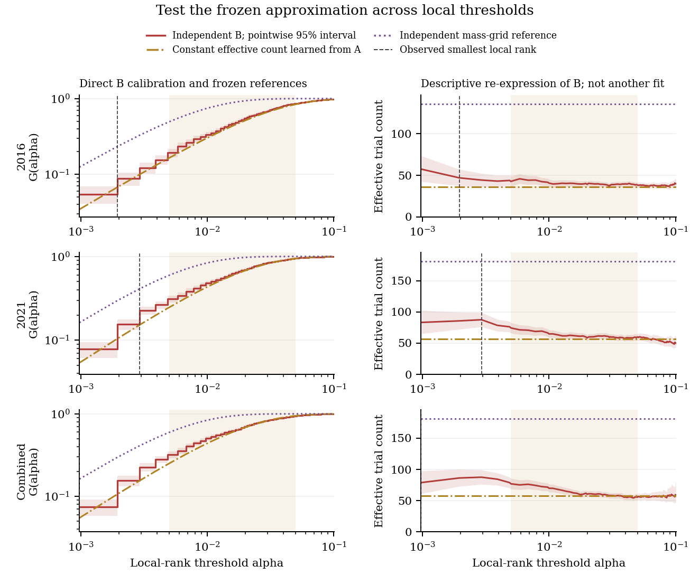

**Read the plot.** One effective count was fitted using A-only thresholds 0.005-0.05; the observed minima lie below that range. B supplies an independent check of the resulting approximation.

**Suggested explanation.** A compact trial-factor formula is useful only after its tail behavior is checked against complete scans.

**Claim boundary.** The effective count is threshold-dependent. Neither the fitted curve nor independent-grid Sidak replaces the direct B result.

[PNG](assets/P24_calibrated_threshold_comparison.png) | [Original vector PDF](assets/P24_calibrated_threshold_comparison.pdf) | [Source data / definition](../../study_results/v6p4p4_calibrated_local_global_20260925/results/threshold_comparison.csv) | [Study package](../../study_results/v6p4p4_calibrated_local_global_20260925)

## P25 - Show why neighboring tested masses are dependent

**Overlapping masks, signal widths, tails and GP conditioning create correlated scan behavior.**

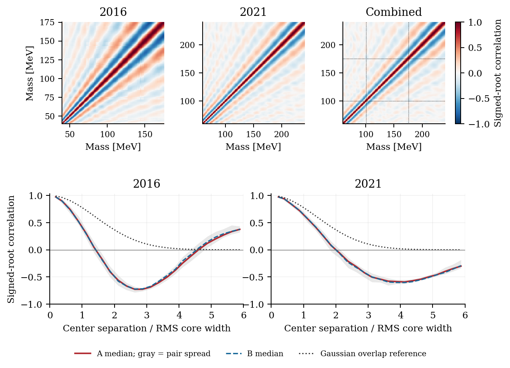

**Read the plot.** Read the mass-correlation matrices and separation measured in MC core-width units. The summary bands show variation across mass pairs.

**Suggested explanation.** The full-scan toys carry these dependencies automatically; counting mass points discards them.

**Claim boundary.** Bands over pairs are not confidence intervals. A single resolution count cannot represent every tail threshold or the changing combined model.

[PNG](assets/P25_mass_correlation.png) | [Original vector PDF](assets/P25_mass_correlation.pdf) | [Source data / definition](../../study_results/v6p4p5_mass_correlation_lee_20260926/results/correlation_summary.csv) | [Study package](../../study_results/v6p4p5_mass_correlation_lee_20260926)

## P26 - Compare the real scan with an independence control

**Combined direct p=0.074, versus 0.133 when empirical mass dependence is broken.**

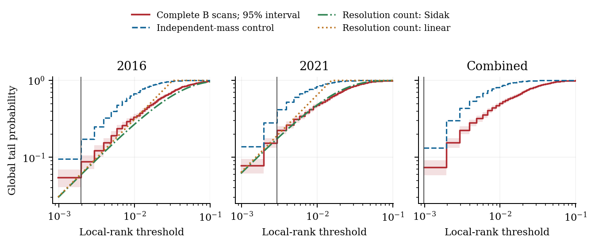

**Read the plot.** The independence control preserves empirical local marginals while changing their dependence. Single-year MC-resolution Sidak gives 0.059 (2016) and 0.174 (2021), below the direct 0.088 and 0.226.

**Suggested explanation.** Correlations reduce the penalty relative to this independence control, but the simple resolution approximation reduces it too far.

**Claim boundary.** This appendix reuses the unchanged A/B arrays; it is not a second independent calibration. No new upper limit is computed.

[PNG](assets/P26_correlation_global_tails.png) | [Original vector PDF](assets/P26_correlation_global_tails.pdf) | [Source data / definition](../../study_results/v6p4p5_mass_correlation_lee_20260926/results/correlation_global_summary.csv) | [Study package](../../study_results/v6p4p5_mass_correlation_lee_20260926)
