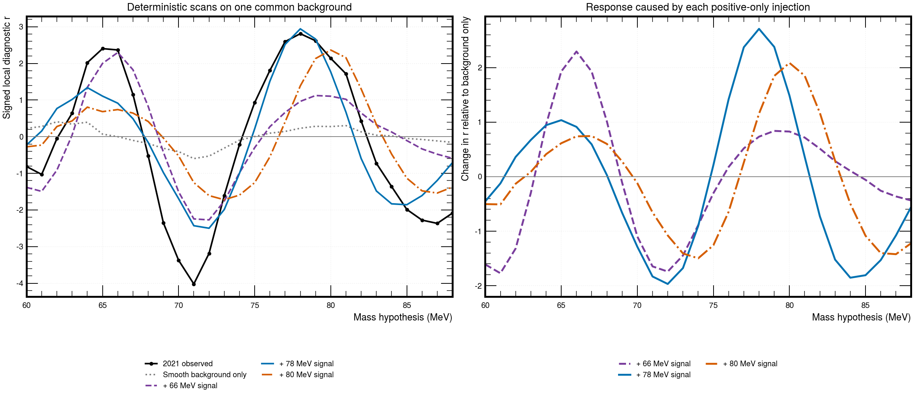
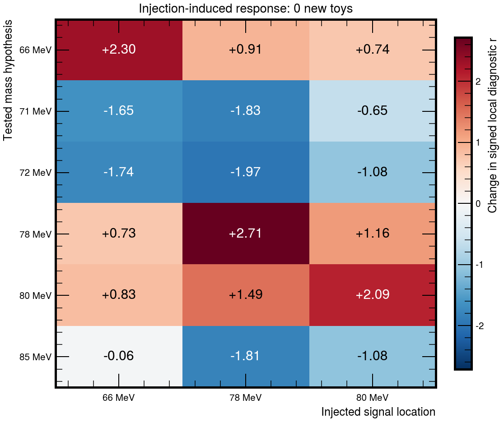
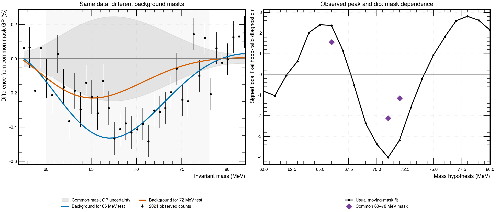
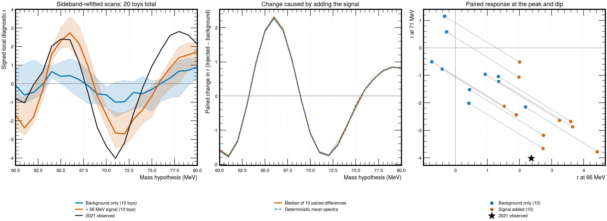

# 2021 peak–dip diagnostic: 20 toys and deterministic reverse check

Published with the [version 4.9.12.5 mass-resolution reference section](../v4p9p12p5_mass_resolution_uncertainty_20260905/README.md).
The [resolution-width scan](resolution_width_scan/README.md) contains the later
full-range comparison and observed signal-yield / coupling upper limits.

Separate side-conversation study; production results and the analysis note are
unchanged. See `PROTOCOL.md` for the frozen design and `derived/summary.json`
for the original pilot's results, source hashes, and reconstruction checks.
The follow-up below adds **zero new toys** and preserves all original pilot
artifacts byte-for-byte.

## Latest result: deterministic 78/80 MeV reverse injections

**The reverse mechanism also occurs:** an injected positive signal near
78–80 MeV produces a negative response near 72 MeV and a smaller positive
response near 66 MeV. Thus neither apparent peak can automatically be treated
as an independent feature of the underlying spectrum.

The table reports injection-induced changes, subtracting the background-only
scan on the same deterministic generating truth:

| Tested mass | Inject at 66 MeV | Inject at 78 MeV | Inject at 80 MeV |
|---|---:|---:|---:|
| 66 MeV | +2.30 | +0.91 | +0.74 |
| 71 MeV | −1.65 | −1.83 | −0.65 |
| 72 MeV | −1.74 | −1.97 | −1.08 |
| 78 MeV | +0.73 | +2.71 | +1.16 |
| 80 MeV | +0.83 | +1.49 | +2.09 |
| 85 MeV | −0.06 | −1.81 | −1.08 |

Values are changes in the signed local likelihood diagnostic r, not
independent significances. The 78 MeV injection uses 19,273 full-template
events, while the 80 MeV injection uses 14,762; each is its own saved
standalone best-fit amplitude. Therefore this is not an equal-yield
comparison or a statistical preference between signal locations.

For the 78 MeV scenario, the **absolute** deterministic responses are +0.91
at 66, −2.43 at 71, −2.50 at 72, +2.94 at 78, and −1.86 at 85 MeV. The
corresponding observed values are +2.37, −4.02, −3.19, +2.81, and −1.99.
It reproduces the qualitative pattern, including a high-side deficit, but
does not by itself reproduce the full low-mass excess or central dip. No
probability for those differences is estimated in this deterministic check.

All three injections were compared on one newly defined smooth background
fitted outside **60–86 MeV**, using the reviewed 66 MeV kernel. This wider
generating mask protects both candidate locations; the original pilot's
60–78 MeV mask would leave part of the higher-mass candidate in training.
The 66 MeV reference was recomputed on this new truth without rerunning toys.
The background-only scan remains visible in the plot because it is not
identically zero. Absolute results should not be mixed with the earlier
pilot's toy medians, which used a different generating truth.

**Interpretation:** bidirectional analysis coupling is demonstrated under
these fixed-kernel assumptions. The study does not determine which observed
feature, if any, is physical, distinguish signal from an upward fluctuation,
or establish discovery significance. No combined-dataset inference was
rerun in this 2021-only follow-up.



*Zero new toys.* Left: observed 2021 and deterministic background-only / three
separate injected-signal scans. Right: the response caused by each injection
after subtracting the same background-only scan. The GP posterior is refitted
at every mass while its reviewed kernel coordinates remain fixed.



*Zero new toys.* The matrix isolates changes at the two candidate locations
and adjacent deficit locations; it is not a matrix of independent p-values.

The follow-up performed 116 deterministic fits and reconstructed 29 saved
observed fits with maximum absolute discrepancy in r of 5.84e-7. One
background-only near-null fit at 66 MeV used the recorded feasible-null
safeguard. All source hashes and original-pilot preservation checks passed,
and both follow-up plots were visually inspected.

Follow-up files: [protocol](reverse_injection/PROTOCOL.md),
[summary](reverse_injection/derived/summary.json),
[response ledger](reverse_injection/derived/injection_induced_delta_r.csv).

## Original 20-toy findings

**A positive-only 66 MeV injection generates an adjacent negative fitted
response.** This pilot therefore demonstrates the proposed analysis mechanism
in this configuration, but does not establish that a real signal caused the
observed feature.

The injected Gaussian has 17,142 full-template events, corresponding to the
saved standalone 2021 best fit at 66 MeV (epsilon squared = 5.247e-6). The
median paired change is computed separately for each pair before taking its
median; it is not a subtraction of independent ensemble medians.

| Mass hypothesis | Observed moving-mask r | Observed common-mask r | Median injection-induced change in r |
|---|---:|---:|---:|
| 66 MeV | +2.366 | +1.555 | +2.303 |
| 71 MeV | −4.019 | −2.121 | −1.649 |
| 72 MeV | −3.186 | −1.158 | −1.744 |

Here r is the signed square root of twice the fitted log-likelihood ratio.
Negative values represent a deficit-like template fit, not a negative
physical coupling. These numbers are conditional local diagnostics, not
toy-calibrated sigma significances.

About 1.9%, 50.0%, and 72.1% of the hypothetical 66 MeV signal falls into the
training bins when testing 66, 71, and 72 MeV, respectively. The background
fit can consequently turn a positive signal into negative neighboring
residuals. The deterministic mean-spectrum comparison independently shows
changes of −1.65 at 71 and −1.74 at 72 MeV, so the paired effect is not merely
one toy's Poisson fluctuation.

The signal-plus-background toys have median r = −2.65 at 71 MeV, compared with
−4.02 in the observed data. Thus this observed-size injection produces a
substantial dip but does not, at the ensemble median, reproduce its entire
observed depth. Even the background-only pilot has median r about −1.00 at
71 MeV (deterministic value −0.84): the selected smooth generating truth is
not exactly unbiased under every moving mask. Do not assign the entire dip
to the injected signal or interpret this small conditional ensemble as a
background-rejection calculation.

The common-mask comparison changes both the predicted background and its
uncertainty; reduced r alone is not proof that either feature is artificial.
The enlarged 60–78 MeV mask is a post-selection diagnostic, not a proposed
replacement analysis choice. A statistical upward fluctuation can also
induce a neighboring negative response. No preference between physical signal,
background fluctuation, and background-model mismatch is quantified here.

## Figures



- `figures/observed_background_mask_comparison.png`: observed 2021 spectrum
  relative to a common 60–78 MeV-excluded GP background, contrasted with the
  usual backgrounds for the 66 and 72 MeV tests; the second panel compares
  signed local fits with the ordinary versus common exclusion masks. Shading
  in the first panel is marginal GP uncertainty, not independent bin pulls.



- `figures/twenty_toy_peak_dip_response.png`: **10 background-only and 10
  signal-plus-background toy spectra**, paired on their background counts.
  Left: median signed scans and descriptive central 68% ranges. Middle:
  injection-induced paired change, including deterministic mean-spectrum
  checks. Right: linked 66/71 MeV responses for each pair and the observed
  2021 point. The full toy spectrum is reused at every scan mass.

Each toy refits the GP posterior mean and covariance from its sidebands but
holds the production kernel coordinates fixed. The smooth generating truth
and injection amplitude are data-selected. This tests a possible mechanism;
it neither establishes a signal nor calibrates a significance. Only twenty
random pseudo-spectra are generated; deterministic mean spectra are not toys.

## Original pilot checks and numerical record

- The 21 observed fits reconstruct the saved 2021 results with maximum
  absolute difference in r of 5.84e-7.
- Exactly 20 saved spectra, 420 toy-by-mass fits, and 42 deterministic
  mean-spectrum fits; no failed or discarded toy spectra.
- One of the 420 toy fits and two deterministic near-null fits used a
  production-style known-feasible-null fallback. Raw likelihood differences
  and fallback flags are retained in the CSV ledgers. The toy fallback was a
  background-only fit at 73 MeV, not one of the three masses in the findings
  table. The deterministic fallback at 66 MeV is explicitly zero-valued.
- One process and one numerical-library thread were used. Source identities,
  runtime identity, seed, and closure are saved in `derived/summary.json`.
- No production result, main report, or original data file was changed.

## Reproduce

From the repository root, run the following in a single-thread environment:

```sh
nice -n 10 venv/bin/python -B study_results/v4p9p12_2021_peak_dip_diagnostic_20toys_20260905/run_diagnostic.py
```

The seed is fixed. A rerun reuses the cached twenty toy spectra and only
overwrites this diagnostic's own fit and figure outputs.

To reproduce only the deterministic follow-up, without generating or
refitting any toys:

```sh
nice -n 10 venv/bin/python -B study_results/v4p9p12_2021_peak_dip_diagnostic_20toys_20260905/reverse_injection/run_reverse_injection.py
```
