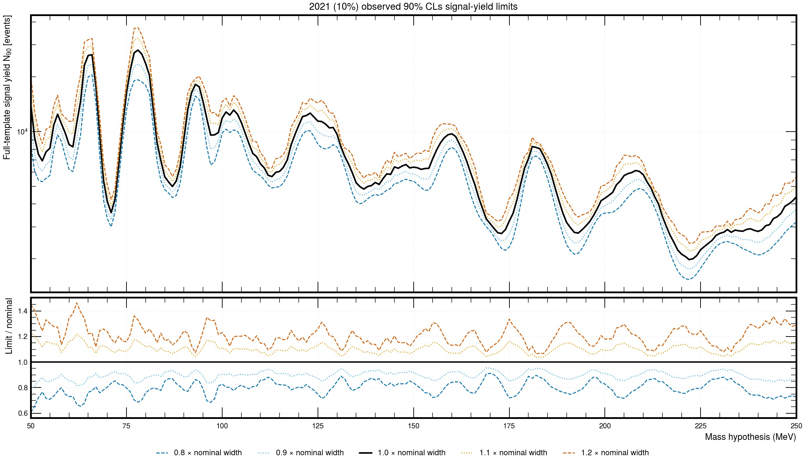
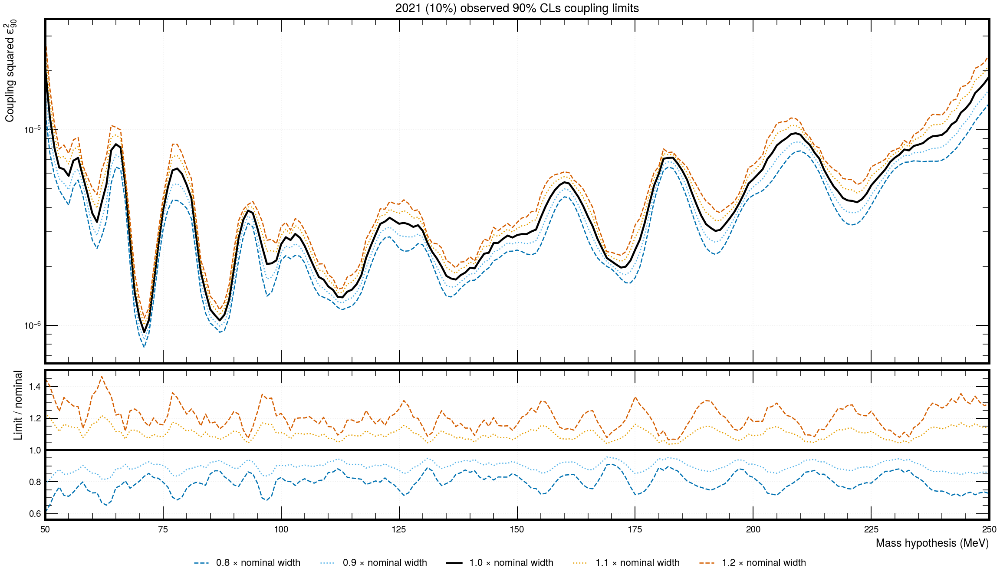
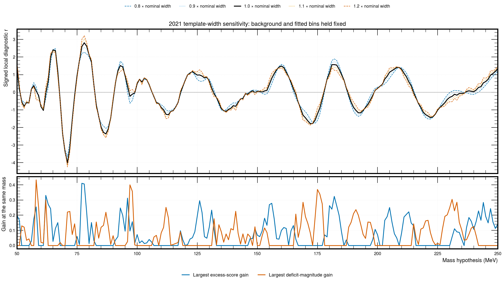
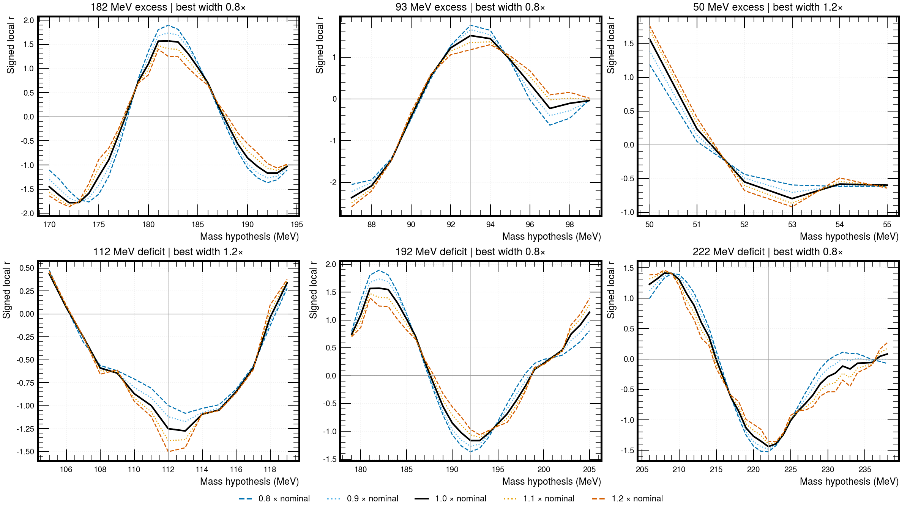

# 2021 resolution-width scan: local structure and upper limits

Completed 5 September 2026. This isolated study uses the v4.9.12 **2021 10%
observed sample**, with reviewed optimized GP support of 36–300 MeV and
length-scale upper factor 15. It scans 201 mass hypotheses, 50–250 MeV in
1 MeV steps, at 0.8, 0.9, 1.0, 1.1, and 1.2 times the nominal signal width.
All **1,005 observed upper limits** are available. **No new toys** were generated;
the preceding 20-toy pilot and reverse-injection study are unchanged.

## Upper-limit results

Changing the width by ±20% typically changes the full-template yield and
epsilon-squared limits by about ±20%: the median ratios across masses are
0.799 and 1.202. The effect is larger near some low-mass structures. At
78 MeV the ratios are 0.687 and 1.329, or −31.3% and +32.9%.

| Mass (MeV) | Nominal yield limit (events) | Nominal epsilon-squared limit | Change with −20% width | Change with +20% width |
|---|---:|---:|---:|---:|
| 66 | 26,459 | 8.098 × 10⁻⁶ | −22.4% | +22.8% |
| 71 | 3,588 | 9.220 × 10⁻⁷ | −16.5% | +18.0% |
| 78 | 28,077 | 6.326 × 10⁻⁶ | −31.3% | +32.9% |
| 80 | 23,680 | 5.221 × 10⁻⁶ | −24.2% | +22.6% |

These are observed 90% CLs upper limits. Across the entire grid, the largest
decrease is −39.3% at the 50 MeV search endpoint with 0.8x width; the largest
increase is +46.3% at 62 MeV with 1.2x width. These extrema describe a width
variation, not an uncertainty band or a choice of the final exclusion curve.



Figure 1. Full-template signal-yield limits for all five widths, with ratios
to nominal below. The background prediction and fitted bins remain fixed
at each mass. Observed data; zero additional toys.



Figure 2. The corresponding limits in the analysis note's epsilon-squared
coordinate. The nominal yield-to-coupling conversion is held fixed, so its
ratio panel matches Figure 1. Unsquared epsilon limits are also tabulated in
the CSV. Observed data; zero additional toys.

## Which structures prefer a changed width?

The 78 MeV excess prefers the broadest tested template: signed local r rises
from +2.810 to +3.216. The 71 MeV deficit also prefers the broadest template,
changing from −4.019 to −4.239. The 66 MeV excess instead slightly prefers
the narrowest template, +2.366 to +2.478. Thus the low-mass pattern persists;
this scan does not identify it as a physical signal or establish a resolution
miscalibration. A larger positive score can coexist with a weaker upper limit,
as at 78 MeV, because a broader positive component accommodates more events.

The largest gains among separated regions outside the prior 60–88 MeV focus
are modest:

| Region | Preferred tested width | Nominal r at that mass | Varied-width r |
|---|---:|---:|---:|
| 182 MeV excess | 0.8x | +1.570 | +1.894 |
| 93 MeV excess | 0.8x | +1.515 | +1.762 |
| 112 MeV deficit | 1.2x | −1.250 | −1.502 |
| 192 MeV deficit | 0.8x | −1.167 | −1.367 |



Figure 3. Signed local scores and the largest same-mass gain from the tested
widths. Excesses and deficits are shown separately in the lower panel.
These are post-selection diagnostics, not trials-corrected significances.
Observed data; zero additional toys.



Figure 4. Three positive and three negative regions with the largest gains
over their nominal regional extrema outside 60–88 MeV. The 50 MeV panel is
a search-grid endpoint. Region grouping is specified in the protocol and
is not an independent-trials calculation. Observed data; zero additional toys.

## What is held fixed, and what is recomputed?

At each mass, reconstruct the GP posterior using its reviewed kernel, then
hold its mean, covariance, and nominal ±2.25-sigma training exclusion and
fitted bins fixed. Integrate each varied-width Gaussian over those same
bins and profile the signal amplitude and Gaussian background nuisances.
The 90% CLs construction uses the production bounded piecewise asymptotic
solver, including its likelihood-nesting and numerical checks.

Let K(m) be the saved full-template signal yield per epsilon squared, and
f(m, width) the signal fraction in the fixed fitted bins. The signal supplied
to the likelihood is K times the unnormalized in-window template. Hence
N90(full) = K * epsilon²90 and N90(window) = f * N90(full). Only f and the
template shape vary; K, its density normalization, and the data do not.

This is a **template-width sensitivity scan**, not a complete detector-resolution
systematic rerun. No resolution nuisance is constrained, profiled, or
marginalized; no new expected bands or global p-values are calculated. Do not
select the most favorable observed mass or width as an independent result.

## Checks and reproducibility

- All 201 nominal limits reproduce the saved production curve: maximum
  relative difference 1.28 × 10⁻⁶ (0.000128%). Signed-r closure is 1.61 × 10⁻⁵.
- All 1,005 final limit fits pass the solver's checks; maximum absolute
  residual from CLs = 0.1 is 2.87 × 10⁻⁷.
- Four initially rejected limits passed a tighter-optimizer retry with the
  same likelihood and unchanged acceptance gates: (50 MeV, 1.2x),
  (64 MeV, 0.9x), (99 MeV, 1.2x), and (169 MeV, 0.9x). Their initial errors,
  retry method, and final profile diagnostics are retained. Production code
  was not edited. See [PROTOCOL.md](PROTOCOL.md) for exact tolerances.
- Prior study files and all numerical inputs are checked against SHA-256
  hashes. The run uses one low-priority process and one numerical thread;
  the 1,005 fits and limits took about 18 seconds, excluding import and plots.
- All four figures were visually inspected for readability and overlap.

From the repository root:

```bash
nice -n 10 venv/bin/python -B study_results/v4p9p12_2021_peak_dip_diagnostic_20toys_20260905/resolution_width_scan/run_width_scan.py
venv/bin/python -B study_results/v4p9p12_2021_peak_dip_diagnostic_20toys_20260905/resolution_width_scan/validate_outputs.py
```

Machine-readable results: [upper limits](derived/width_scan_upper_limits.csv),
[all signed fits and limits](derived/width_scan_all_points.csv),
[regional comparisons](derived/other_regions_ranked_by_gain.csv),
[summary and provenance](derived/summary.json),
[full limit diagnostics](derived/limit_solver_diagnostics.json), and
[validation report](derived/validation.json).
